# Prerequisitos

- 4 máquinas virtuais com 2/4 processadores e 6/8 gb de memória ram e 30Gb de HD
- 1 domínio
- Sistema operacional Ubuntu 16.04 LTS
- Domínio a ser utilizado: rcic.com.br

[Kubernetes Projeto](https://github.com/robertocorreajr/Kubernetes-Projeto)


Teremos 1 máquina que será o Rancher Server e outras 3 máquinas que serão os Kubernetes de produção.
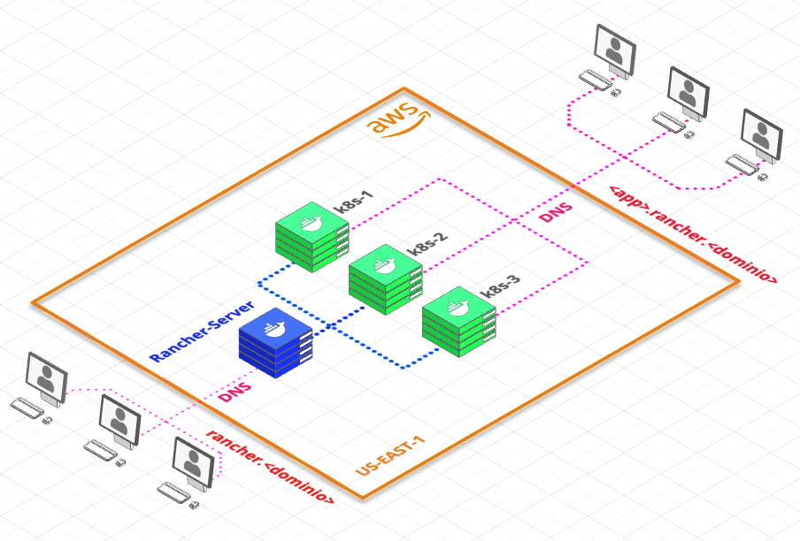

Vou configurar no domínio para apontar para o DNS do Google que será onde eu vou criar as máquinas virtuais e lá no DNS do google eu vou criar entradas do qual o endereço rancher.rci.com.br vai apontar para a máquina quer será o Rancher Server.

Também vou criar um balanceamento com Wildcard ( * ) que conterá os 3 iPs dos outros servidores.


# Domínio

Após dominio criado modificar as entradas DNS para apontar para o DNS do Google ou o provedor escolhido, como por exemplo os DNS da AWS. Para que possamos fazer essa configuração, vamos acessar o GCP e acessar o serviço Cloud DNS para criar uma nova zona que vai receber o domínio.

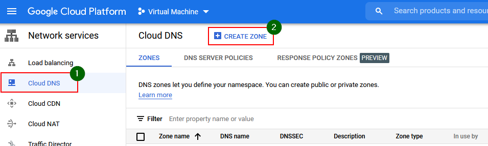

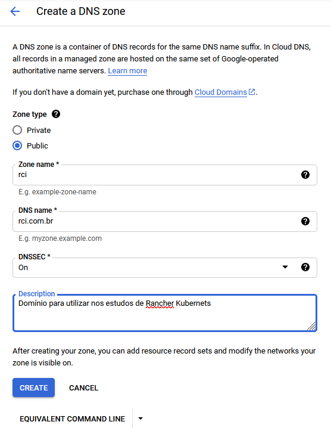

Expandir a entrada do registro NS para poder pegar os endereços DNS do google que serão preenchidos no site do Registro Br.
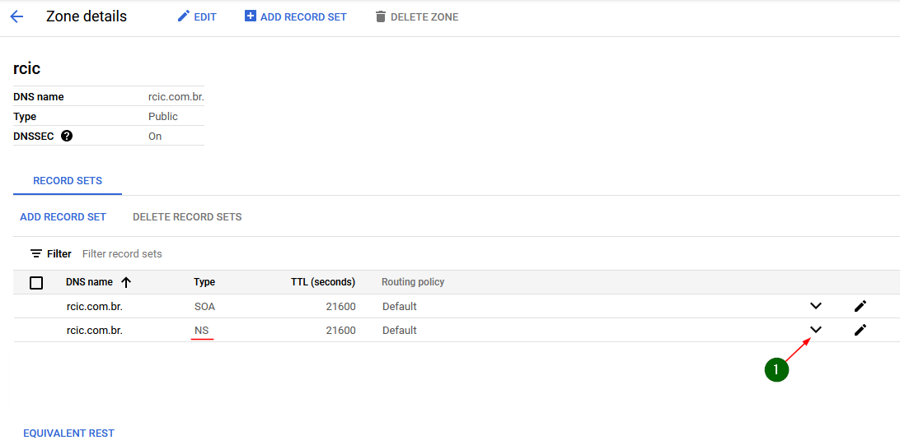
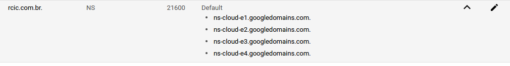

Acessar o site do Registro Br e adicionar as entradas DNS.

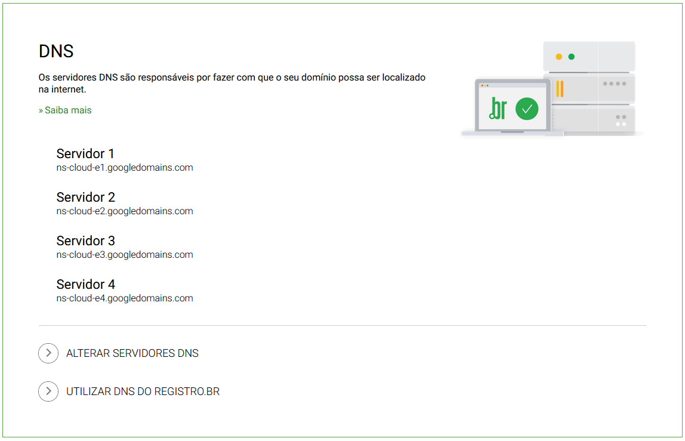

# Criação do ambiente

Agora vamos acessar Compute Engine e criar as máquinas virtuais. "VM Instance".
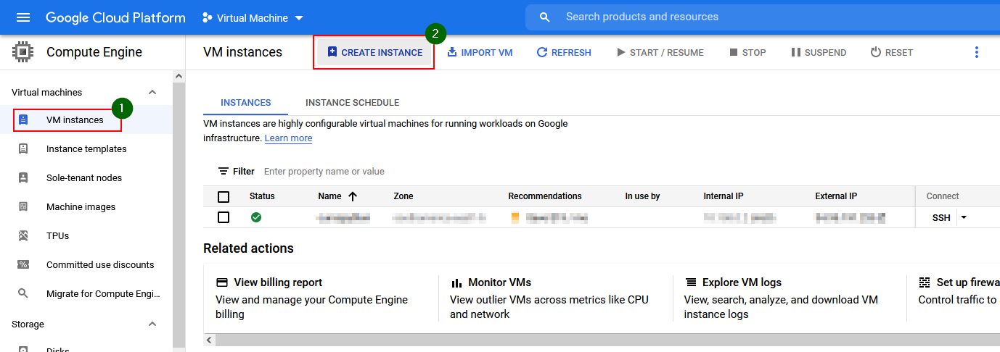

### Configurações da instância.
Do o nome da instância e na guia de configuração da máquina, vou na opção personalisada e escolho 2 à 4 processadores com no minimo 6Gb de memória.
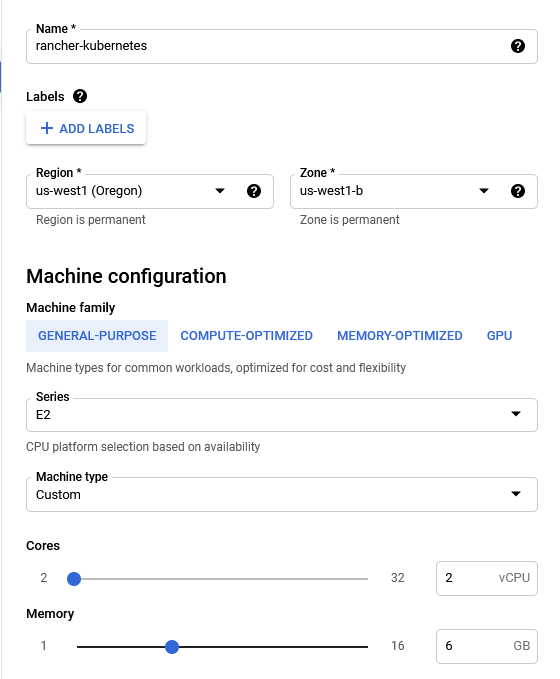

### Boot disk
Também é necessário escolher em Boot disk a imagem do Ubuntu 16.04 TLS e o tamanho do HD. "30Gb"

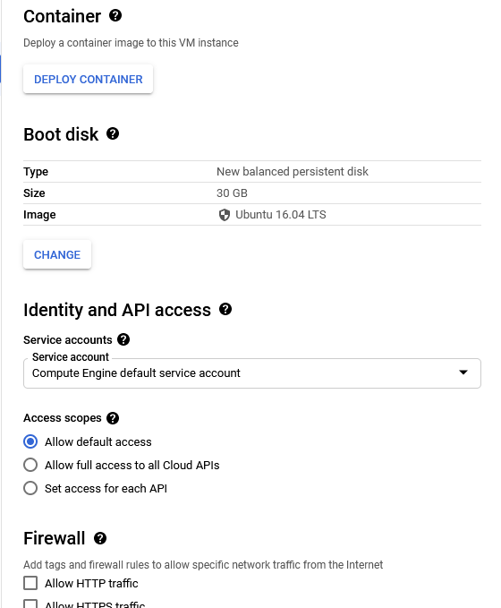

### Script de criação das instâncias.
Abaixo, segue script para a criação de todas as máquinas pela CLI com 4 processadores, 6Gb de RAM e 30Gb de HD. 
```sh
gcloud compute instances create rancher-kubernetes --project=ordinal-link-321822 --zone=us-west1-b --machine-type=e2-custom-4-6144 --network-interface=network-tier=PREMIUM,subnet=default --maintenance-policy=MIGRATE --service-account=1005677283607-compute@developer.gserviceaccount.com --scopes=https://www.googleapis.com/auth/devstorage.read_only,https://www.googleapis.com/auth/logging.write,https://www.googleapis.com/auth/monitoring.write,https://www.googleapis.com/auth/servicecontrol,https://www.googleapis.com/auth/service.management.readonly,https://www.googleapis.com/auth/trace.append --create-disk=auto-delete=yes,boot=yes,device-name=rancher-kubernetes,image=projects/ubuntu-os-cloud/global/images/ubuntu-1604-xenial-v20210928,mode=rw,size=30,type=projects/ordinal-link-321822/zones/us-west1-b/diskTypes/pd-balanced --no-shielded-secure-boot --shielded-vtpm --shielded-integrity-monitoring --reservation-affinity=any

gcloud compute instances create k8s-1 --project=ordinal-link-321822 --zone=us-west1-b --machine-type=e2-custom-4-6144 --network-interface=network-tier=PREMIUM,subnet=default --maintenance-policy=MIGRATE --service-account=1005677283607-compute@developer.gserviceaccount.com --scopes=https://www.googleapis.com/auth/devstorage.read_only,https://www.googleapis.com/auth/logging.write,https://www.googleapis.com/auth/monitoring.write,https://www.googleapis.com/auth/servicecontrol,https://www.googleapis.com/auth/service.management.readonly,https://www.googleapis.com/auth/trace.append --create-disk=auto-delete=yes,boot=yes,device-name=rancher-kubernetes,image=projects/ubuntu-os-cloud/global/images/ubuntu-1604-xenial-v20210928,mode=rw,size=30,type=projects/ordinal-link-321822/zones/us-west1-b/diskTypes/pd-balanced --no-shielded-secure-boot --shielded-vtpm --shielded-integrity-monitoring --reservation-affinity=any

gcloud compute instances create k8s-2 --project=ordinal-link-321822 --zone=us-west1-b --machine-type=e2-custom-4-6144 --network-interface=network-tier=PREMIUM,subnet=default --maintenance-policy=MIGRATE --service-account=1005677283607-compute@developer.gserviceaccount.com --scopes=https://www.googleapis.com/auth/devstorage.read_only,https://www.googleapis.com/auth/logging.write,https://www.googleapis.com/auth/monitoring.write,https://www.googleapis.com/auth/servicecontrol,https://www.googleapis.com/auth/service.management.readonly,https://www.googleapis.com/auth/trace.append --create-disk=auto-delete=yes,boot=yes,device-name=rancher-kubernetes,image=projects/ubuntu-os-cloud/global/images/ubuntu-1604-xenial-v20210928,mode=rw,size=30,type=projects/ordinal-link-321822/zones/us-west1-b/diskTypes/pd-balanced --no-shielded-secure-boot --shielded-vtpm --shielded-integrity-monitoring --reservation-affinity=any

gcloud compute instances create k8s-3 --project=ordinal-link-321822 --zone=us-west1-b --machine-type=e2-custom-4-6144 --network-interface=network-tier=PREMIUM,subnet=default --maintenance-policy=MIGRATE --service-account=1005677283607-compute@developer.gserviceaccount.com --scopes=https://www.googleapis.com/auth/devstorage.read_only,https://www.googleapis.com/auth/logging.write,https://www.googleapis.com/auth/monitoring.write,https://www.googleapis.com/auth/servicecontrol,https://www.googleapis.com/auth/service.management.readonly,https://www.googleapis.com/auth/trace.append --create-disk=auto-delete=yes,boot=yes,device-name=rancher-kubernetes,image=projects/ubuntu-os-cloud/global/images/ubuntu-1604-xenial-v20210928,mode=rw,size=30,type=projects/ordinal-link-321822/zones/us-west1-b/diskTypes/pd-balanced --no-shielded-secure-boot --shielded-vtpm --shielded-integrity-monitoring --reservation-affinity=any
```

### Instâncias criadas:
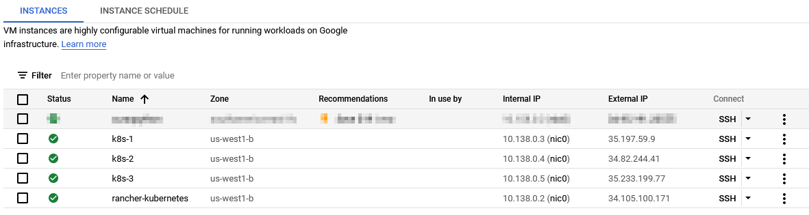

### Instalação do Docker:

```sh
ssh casa@34.105.100.171     - rancher
ssh casa@35.197.59.9        - k8s-1
ssh casa@34.82.244.41       - k8s-2
ssh casa@35.233.199.77      - k8s-3
```
Vou acessar cada uma das máquinas e instalar o docker e também vou adicionar o usuário ubuntu no groupo docker, após instalado podemos testar executando o comando docker ps.
```sh
sudo su
curl https://releases.rancher.com/install-docker/19.03.sh | sh
usermod -aG docker ubuntu

docker ps
```
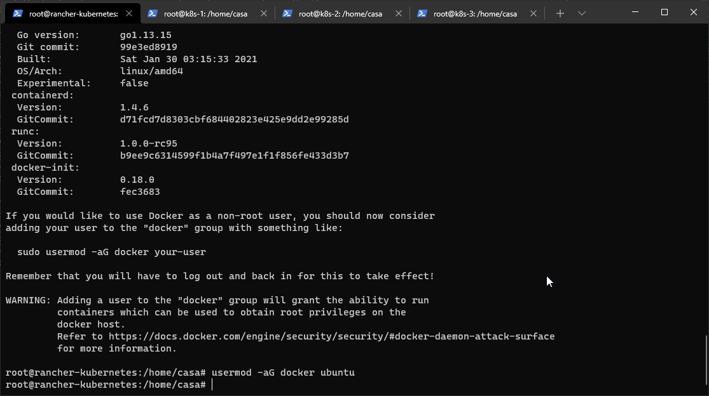

### Cloud DNS:
Vou configurar agora as entradas do DNS que vão apontar para o rancher e um balanceador que será configurado com *Wildcard ( * )*

Acessar a zona criada.

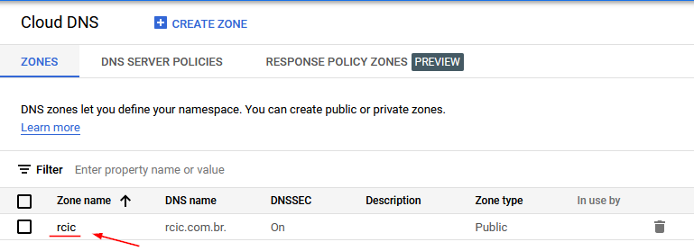

### Script de criação das entradas DNS:
```sh
gcloud beta dns --project=ordinal-link-321822 record-sets transaction start --zone="rcic" && gcloud beta dns --project=ordinal-link-321822 record-sets transaction add 34.105.100.171 --name="rancher.rcic.com.br." --ttl="300" --type="A" --zone="rcic" && gcloud beta dns --project=ordinal-link-321822 record-sets transaction execute --zone="rcic"

gcloud beta dns --project=ordinal-link-321822 record-sets transaction start --zone="rcic" && gcloud beta dns --project=ordinal-link-321822 record-sets transaction add 35.197.59.9 34.82.244.41 35.233.199.77 --name="*.rancher.rcic.com.br." --ttl="300" --type="A" --zone="rcic" && gcloud beta dns --project=ordinal-link-321822 record-sets transaction execute --zone="rcic"

```
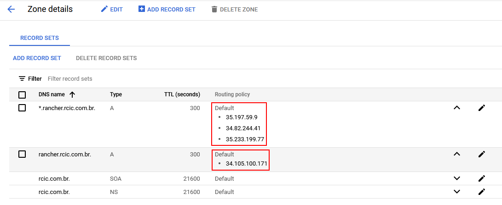

# Git / Docker Compose / Images builds

### Instalando o GIT
```sh
sudo su
apt-get install git -y
```

### O que é e faz o docker-compose?
Docker Compose é uma ferramenta que foi desenvolvida para ajudar a definir e compartilhar aplicativos de vários contêineres. Com o Compose, você pode criar um arquivo YAML para definir os serviços e, com um único comando, pode girar tudo ou destruir tudo.

A grande vantagem de usar o Compose é que você pode definir sua pilha de aplicativos em um arquivo, mantê-la na raiz do seu repo do projeto (agora ele é controlado por versão) e permitir facilmente que outra pessoa contribua com seu projeto. Alguém só precisaria clonar seu repo e iniciar o aplicativo de composição. Na verdade, você pode ver alguns projetos no GitHub/GitLab fazendo exatamente isso agora.

[Documentação oficial](https://docs.docker.com/compose/install/)

### Baixando o Docker Compose:
```sh
curl -L "https://github.com/docker/compose/releases/download/1.25.5/docker-compose-$(uname -s)-$(uname -m)" -o /usr/local/bin/docker-compose
```

### Aplicando permissão de execução ao binário:
```sh
chmod +x /usr/local/bin/docker-compose
```

### Criando um link simbolico para o executavel.
*( Para windows Users, seria como se criasse um atalho. "Shortcut" )*
```sh
ln -s /usr/local/bin/docker-compose /usr/bin/docker-compose
```

Com os pacotes já instalados vou clonar o repositório para o meu servidor.
```sh
cd /home/ubuntu
git clone https://github.com/robertocorreajr/Kubernetes-Projeto
cd devops/exercicios/app
```
<br>
<br>

### Fazendo build de um container REDIS
```sh
cd redis
docker build -t robertocorrea/redis:devops .
docker run -d --name redis -p 6379:6379 robertocorrea/redis:devops
docker ps
docker logs redis
```
Com isso temos o container do Redis rodando na porta 6379.
<br>
<br>

### Fazendo build de um container NODE.
Criando a imagem
```sh
cd ../node
docker build -t robertocorrea/node:devops .
```

Agora iremos rodar a imagem do node, fazendo a ligação dela com o container do Redis.
```sh
docker run -d --name node -p 8080:8080 --link redis robertocorrea/node:devops
docker ps 
docker logs node
```
Com isso temos nossa aplicação rodando, e conectada no Redis. A api para verificação pode ser acessada em /redis.
<br>
<br>

### Container=NGINX
Iremos fazer o build do container do nginx, que será nosso balanceador de carga.
```sh
cd ../nginx
docker build -t robertocorrea/nginx:devops .
```
Criando o container do nginx a partir da imagem e fazendo a ligação com o container do Node
```sh
docker run -d --name nginx -p 80:80 --link node robertocorrea/nginx:devops
docker ps
```
Podemos acessar então nossa aplicação nas portas 80 e 8080 no ip da nossa instância.

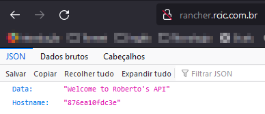

Iremos acessar a api em /redis para nos certificar que está tudo ok, e depois iremos limpar todos os containers e volumes.
```sh
docker rm -f $(docker ps -a -q)
docker volume rm $(docker volume ls)
```
<br>
<br>

### Docker Compose

Até agora foi feito um exercício onde foi colocado alguns containers para rodar e eles foram interligando. Foi possivel ver como funciona a aplicação que possui um contador de acessos, mas essa aplicação estava rodando apenas na máquina principal que estava destinada ao rancher. Então uma das ultimas tarefas foi remover os containers que utilizamos e seus volumes. 

Agora vamos preparar para *"buildar"* 

Nesse exercício que fizemos agora, colocamos os containers para rodar, e interligando eles, foi possível observar  como funciona nossa aplicação que tem um contador de acessos.
Para rodar nosso docker-compose, precisamos remover todos os containers que estão rodando e ir na raiz do diretório para rodar.

É preciso editar o arquivo docker-compose.yml, onde estão os nomes das imagens e colocar o seu nome do repositório que você criou.

- Linha 8   = \<dockerhub-user>/nginx:devops
- Linha 16  = image: \<dockerhub-user>/redis:devops
- Linha 33  = image: \<dockerhub-user>/node:devops

<br>
*Abaixo o arquivo já editado*
<br>

```yml
# Versão 2 do Docker-Compose
version: '2'

services:
    
    nginx:
        restart: "always"
        image: robertocorrea/nginx:devops
        ports:
            - "80:80"
        links:
            - node
            
    redis:
        restart: "always"
        image: robertocorrea/redis:devops
        ports:
            - 6379

    mysql:
        restart: "always"
        image: mysql
        ports:
            - 3306
        environment:
            MYSQL_ROOT_PASSWORD: 123
            MYSQL_DATABASE: books
            MYSQL_USER: apitreinamento
            MYSQL_PASSWORD: 123 

    node:
        restart: "always"
        image: robertocorrea/node:devops
        links:
            - redis
            - mysql
        ports:
            - 8080
        volumes:
            -  volumeteste:/tmp/volumeteste

# Mapeamento dos volumes
volumes:
    volumeteste:
        external: false
```
<br>

**OBS:** *Note que quando removemos os container, mantivemos a imagem dos container e será essas imagens que vamos utilizar nesse build.*
<br>

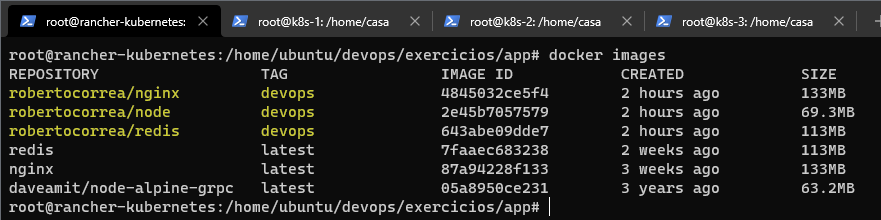

Após alterar e colocar o nome correto das imagens, rodar o comando de *up -d* para subir toda a stack.

```sh
cd ..
vi docker-compose.yml
docker-compose -f docker-compose.yml up -d
curl rancher.rcic.com.br:80
```

```sh
curl rancher.rcic.com.br:80/redis
	----------------------------------
	This page has been viewed 29 times
	----------------------------------
```

Se acessarmos o IP na porta 80 vamos ver a aplicação rodando e também podemos acessar o /redis para ver o contador de acesso à essa página incrementando a cada acesso.
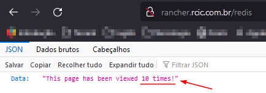

Explicação: Toda essa aplicação foi *"deployada"*  de uma só vez com um unico arquivo docker *docker file*. Ele criou todo um deploy de aplicação, totalmente padronizado e com todas as suas dependências satisfeitas.

Agora para finalizar vamos terminar a nossa aplicação temos que rodar o comando do docker-compose abaixo:
```sh
docker-compose down
```
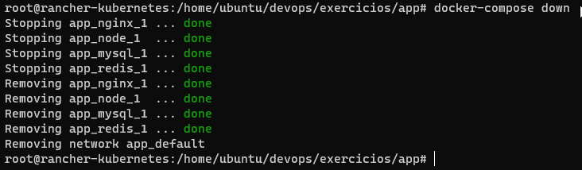

<br>
<br>

# Rancher - Single Node
[Rancher](https://rancher.com/)


O Rancher permite que tenhamos vários cluster Kubernetes gerenciados pelo Rancher, como por exemplo um Cluster Kubernets para Desenvolvimento, outro para Produção, Testes etc...
Por padrão o Kubernetes não tem a autenticação LDAP para os usuários, então o Rancher pode cuidar dessa autenticação e não precisaremos mais nos preocupar com essa integração do Kubernetes. Podemos configurar o Rancher para rodar inclusive Multi-Cloud.

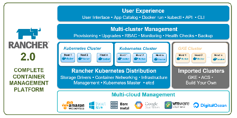

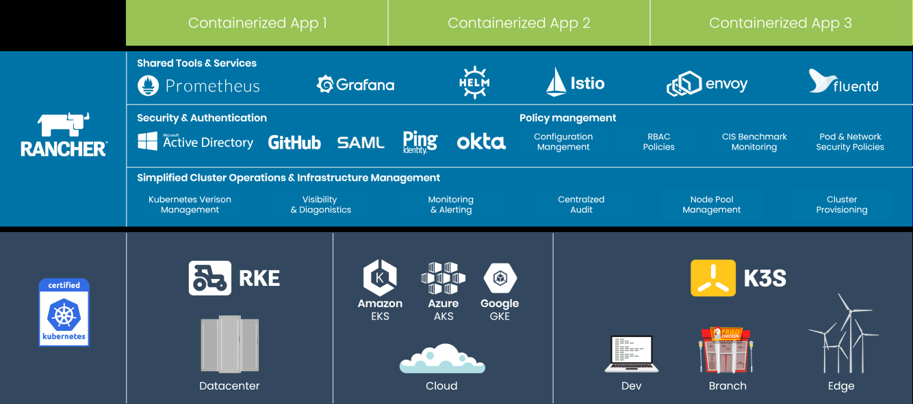

https://www.delltechnologies.com/asset/nl-nl/products/converged-infrastructure/industry-market/rancher-cluster-with-vxflex-csi-000066.pdf

Vamos iniciar realizando a instalação do Rancher Single Node.
Nesse exemplo será instalado o Rancher 2.4.3. Primeiramente vou acessar a máquina que será utilizada para o Rancher Server e executar o comando abaixo:
```sh
docker run -d --name rancher --restart=unless-stopped -v /opt/rancher:/var/lib/rancher  -p 80:80 -p 443:443 rancher/rancher:v2.4.3
```
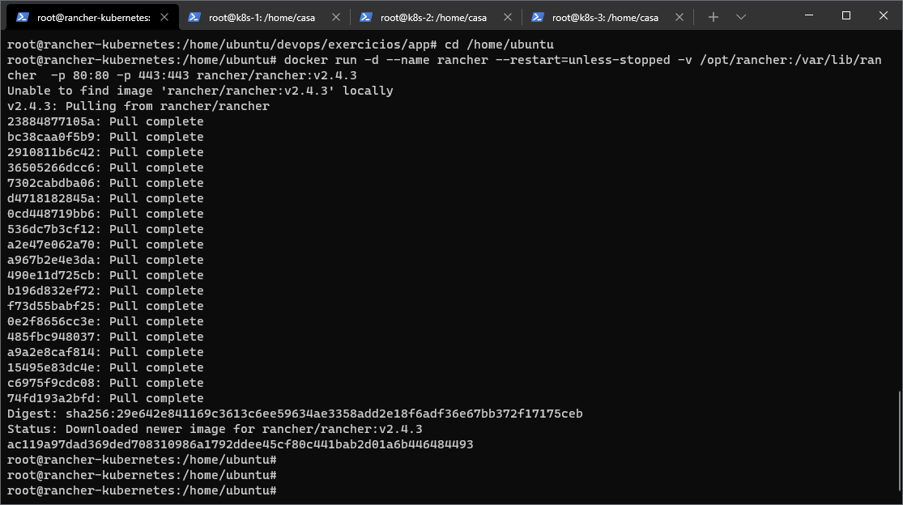

> Observe que no comando temos a opção `-v /opt/rancher:/var/lib/rancher` que está criando um volume `/opt/rancher` que é no próprio disco da máquina e dentro do container ele será mapeando para o diretório `/var/lib/rancher`.

Dessa forma se o container morrer, ao ser recriado ele voltará ao normal sem nenhum problema, já que seus dados estarão salvos em outro local.

*Abaixo deixo guardado o usuário e senha dessa instalação. Provavelmente se você estiver lendo esse arquivo e tentar utilizar essas credenciais elas não funcionarão mais ou talvez nem o ambiente esteja mais online, visto que eu o criei apenas para fins de estudos.*
```sh
usuário: admin
password: YdsLeqxFGk5Dud9
```

> Um adendo que quero fazer é sobre a parte de segurança e autenticação. No Rancher temos já integrado vários tipos de autenticação disponíveis. Então não precisariamos lidar com esse tipo de problema no Kubernetes uma vez que isso será feito pelo Rancher.
> 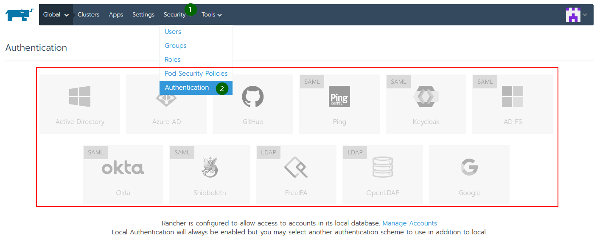
<br>
<br>

# Instalação do Cluster Kubernetes
Para criar o cluster, vamos acessar o Rancer e em *Add Cluster*.
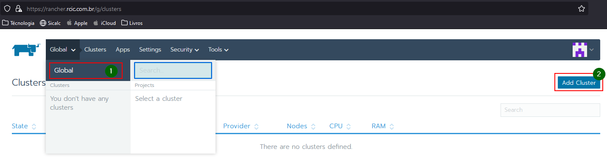

Vamos escolher a opção *From existing nodes (Custom)*
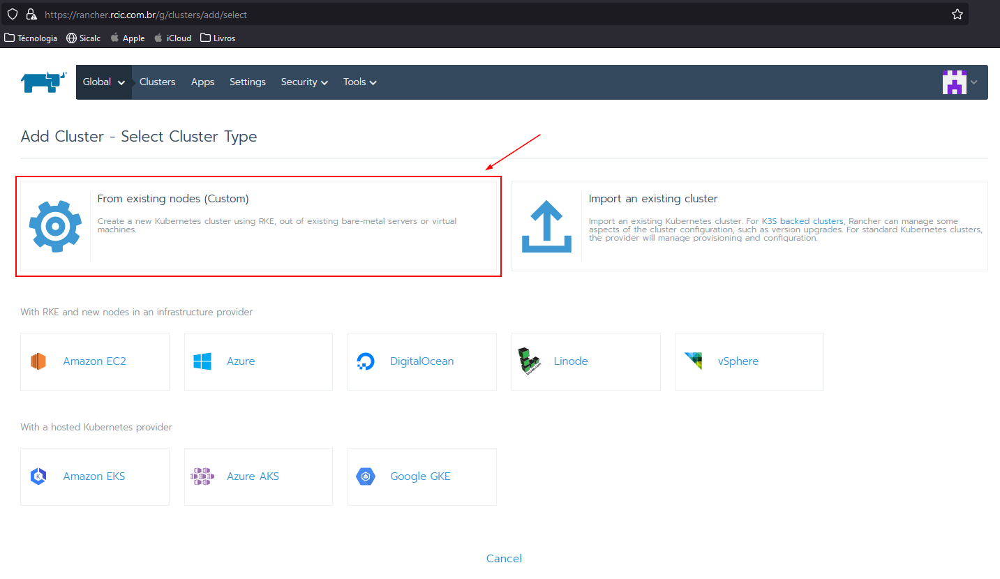

Em nosso exemplo, vamos mudar poucas coisas. 
Primeiramente vamos dar um nome, no meu caso eu dei o nome de *padawan*.
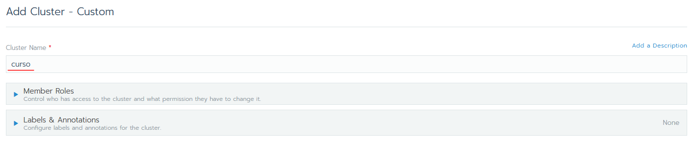

Mais abaixo tem uma opção importante que não pode deixar de ser marcada ou nesse caso desabilitada. Que é o Nginx Ingress. 
> Por padrão o Rancher já instala o Nginx Ingress por padrão, mas vamos deixar desabilitado nesse exemplo para podermos utilizar o Traefic e mais para frente vamos executar utilizando o Nginx Ingress portanto, calma jovem Padawan.
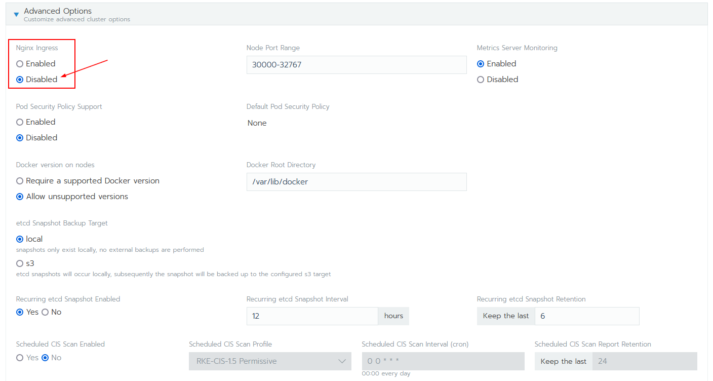

Após clicar em Next seremos direcionados para a próxima tela de configuração onde vamos ter o script que executaremos nas 3 máquinas que vão compor o Cluster Kubernetes. Para que elas tenham as mesmas funções vamos selecionar as 3 opções etcd, Control Plane e Worker. Também vou expandir a guia advanced options para poder escolher um node name que vou chamar o primeiro de k8s-1, vou copiar o script e alterar para na segunda máquina executar como k8s-2 e na terceira de k8s3. Observe também que essas opções foram adicionadas ao final da linha de comando.
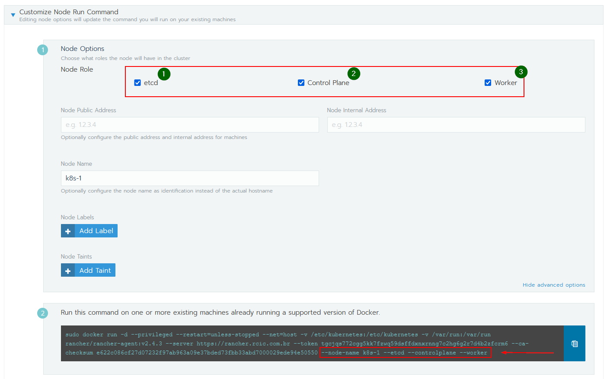

Segue abaixo o script gerado:

Servidor 1
```sh
sudo docker run -d --privileged --restart=unless-stopped --net=host -v /etc/kubernetes:/etc/kubernetes -v /var/run:/var/run rancher/rancher-agent:v2.4.3 --server https://rancher.rcic.com.br --token tgcjqs772cgg5kk7fzwq59dsffdxnxrnng7c2hg6g2r7d4b2zfcrm6 --ca-checksum e622c086cf27d07232f97ab963a09e37bded73fbb33abd7000029ede94e50550 --node-name k8s-1 --etcd --controlplane --worker
```

Servidor 2
```sh
sudo docker run -d --privileged --restart=unless-stopped --net=host -v /etc/kubernetes:/etc/kubernetes -v /var/run:/var/run rancher/rancher-agent:v2.4.3 --server https://rancher.rcic.com.br --token tgcjqs772cgg5kk7fzwq59dsffdxnxrnng7c2hg6g2r7d4b2zfcrm6 --ca-checksum e622c086cf27d07232f97ab963a09e37bded73fbb33abd7000029ede94e50550 --node-name k8s-2 --etcd --controlplane --worker
```

Servidor 3
```sh
sudo docker run -d --privileged --restart=unless-stopped --net=host -v /etc/kubernetes:/etc/kubernetes -v /var/run:/var/run rancher/rancher-agent:v2.4.3 --server https://rancher.rcic.com.br --token tgcjqs772cgg5kk7fzwq59dsffdxnxrnng7c2hg6g2r7d4b2zfcrm6 --ca-checksum e622c086cf27d07232f97ab963a09e37bded73fbb33abd7000029ede94e50550 --node-name k8s-3 --etcd --controlplane --worker
```
Vamos entrar em cada uma das máquinas destinadas à membros do cluster e realizar o deploy do Kubernetes, cada um com o seu respectivo script.

Após a execução do Script o Rancher vai se encarregar de fazer todo o deploy nas máquinas. Podemos observer o status indo na interface do rancher e acessar o pelo nome do cluster e posteriormente nodes.
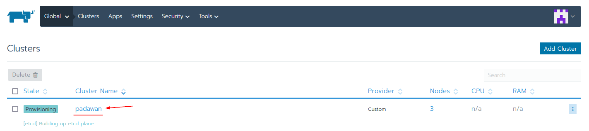
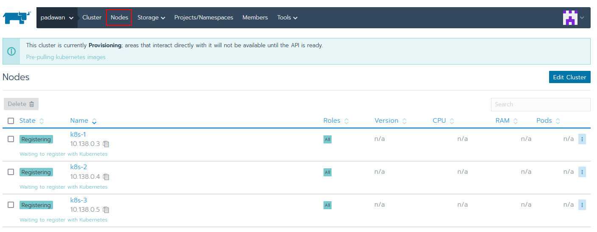

Devemos aguardar até o termino de todo o deploy, uma vez que ele da algumas mensagens de erro e volta a tentar realizar o deploy novamente até que tudo esteja realmente instalado e finalizado.
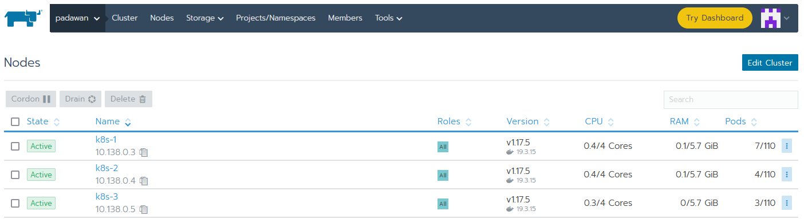
<br>
<br>

# Instalação do Kubectl
O que é o kubctl?
É a **`CLI`** - *`"comand line interface"`* do Kubernetes e é atravez dela que vamos interagir com o Cluster. 
Vamos precisar instalar ela apenas no servidor do Rancher Server, para isso vou acessar a máquina via SSH e executar a instalação abaixo:
> OBS: executar cada linha separadamente.
> ```sh
> apt-get update && apt-get install -y apt-transport-https gnupg2
> ```
> ```sh
> curl -s https://packages.cloud.google.com/apt/doc/apt-key.gpg | apt-key add -
> ```
> ```sh
> echo "deb https://apt.kubernetes.io/ kubernetes-xenial main" | tee -a /etc/apt/sources.list.d/kubernetes.list
> ```
> ```sh
> apt-get update
> ```
> ```sh
> apt-get install -y kubectl
> ```

Com essa instalação ao executar comandos pelo Kubectl ele vai disparar os comando para ele mesmo (Rancher) e ele vai encaminhar os comandos para o Cluster Kubernetes que estão agregados. Então agora todas as execuções serão feitas por arquivos *`yml`*

Bom após a instalação do Kubectl vamos acessar novamente à página do rancher e pegar o arquivo Kubeconfig File para rodar no servidor Rancher do Cluster.
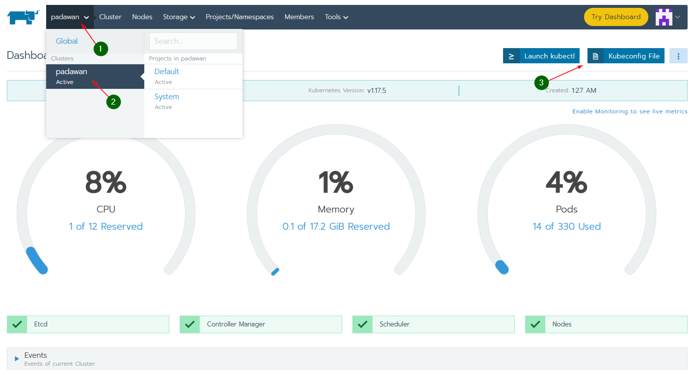

Vai abrir um script que já informa que ele deve ser salvo no caminho: ~/.kube/config
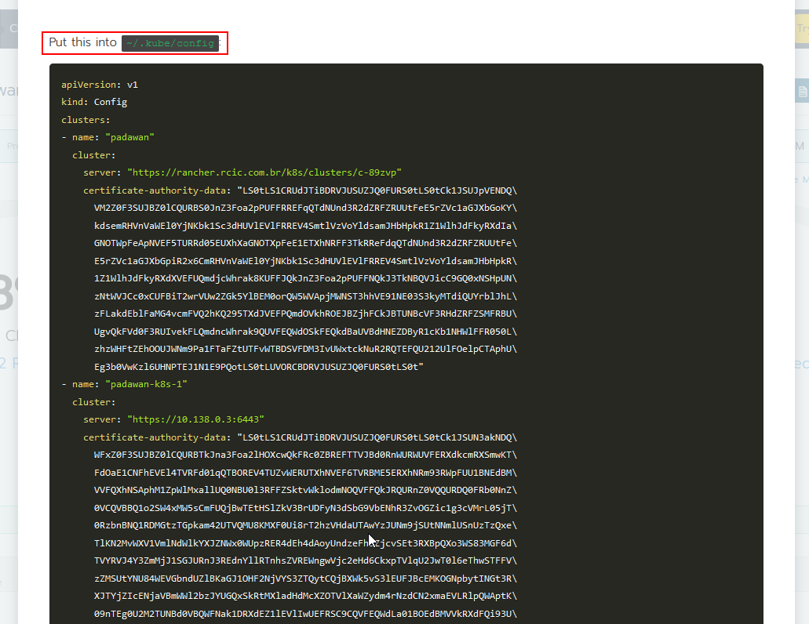

Como estamos utilizando o usuário ubuntu para rodar o Rancher, será necessário utilizar esse usuário para criar o arquivo ou criar como root e mudar o dono do arquivo para o ubuntu. No meu caso eu vou utilizar diretamente o usuário ubuntu.

Primeiro eu vou criar o diretório ~/.kube e depois o arquivo config para aí colar o script abaixo:
```yml
apiVersion: v1
kind: Config
clusters:
- name: "padawan"
  cluster:
    server: "https://rancher.rcic.com.br/k8s/clusters/c-89zvp"
    certificate-authority-data: "LS0tLS1CRUdJTiBDRVJUSUZJQ0FURS0tLS0tCk1JSUJpVENDQ\
      VM2Z0F3SUJBZ0lCQURBS0JnZ3Foa2pPUFFRREFqQTdNUnd3R2dZRFZRUUtFeE5rZVc1aGJXbGoKY\
      kdsemRHVnVaWEl0YjNKbk1Sc3dHUVlEVlFRREV4SmtlVzVoYldsamJHbHpkR1Z1WlhJdFkyRXdIa\
      GNOTWpFeApNVEF5TURRd05EUXhXaGNOTXpFeE1ETXhNRFF3TkRReFdqQTdNUnd3R2dZRFZRUUtFe\
      E5rZVc1aGJXbGpiR2x6CmRHVnVaWEl0YjNKbk1Sc3dHUVlEVlFRREV4SmtlVzVoYldsamJHbHpkR\
      1Z1WlhJdFkyRXdXVEFUQmdjcWhrak8KUFFJQkJnZ3Foa2pPUFFNQkJ3TkNBQVJicC9GQ0xNSHpUN\
      zNtWVJCc0xCUFBiT2wrVUw2ZGk5YlBEM0orQW5WVApjMWNST3hhVE91NE03S3kyMTdiQUYrblJhL\
      zFLakdEblFaMG4vcmFVQ2hKQ295TXdJVEFPQmdOVkhROEJBZjhFCkJBTUNBcVF3RHdZRFZSMFRBU\
      UgvQkFVd0F3RUIvekFLQmdncWhrak9QUVFEQWdOSkFEQkdBaUVBdHNEZDByR1cKb1NHWlFFR050L\
      zhzWHFtZEhOOUJWNm9Pa1FTaFZtUTFvWTBDSVFDM3IvUWxtckNuR2RQTEFQU212UlFOelpCTAphU\
      Eg3b0VwKzl6UHNPTEJ1N1E9PQotLS0tLUVORCBDRVJUSUZJQ0FURS0tLS0t"
- name: "padawan-k8s-1"
  cluster:
    server: "https://10.138.0.3:6443"
    certificate-authority-data: "LS0tLS1CRUdJTiBDRVJUSUZJQ0FURS0tLS0tCk1JSUN3akNDQ\
      WFxZ0F3SUJBZ0lCQURBTkJna3Foa2lHOXcwQkFRc0ZBREFTTVJBd0RnWURWUVFERXdkcmRXSmwKT\
      FdOaE1CNFhEVEl4TVRFd01qQTBOREV4TUZvWERUTXhNVEF6TVRBME5ERXhNRm93RWpFUU1BNEdBM\
      VVFQXhNSAphM1ZpWlMxallUQ0NBU0l3RFFZSktvWklodmNOQVFFQkJRQURnZ0VQQURDQ0FRb0NnZ\
      0VCQVBBQ1o2SW4xMW5sCmFUQjBwTEtHSlZkV3BrUDFyN3dSbG9VbENhR3ZvOGZic1g3cVMrL05jT\
      0RzbnBNQ1RDMGtzTGpkam42UTVQMU8KMXF0Ui8rT2hzVHdaUTAwYzJUNm9jSUtNNmlUSnUzTzQxe\
      TlKN2MvWXV1VmlNdWlkYXJZNWx0WUpzRER4dEh4dAoyUndzeFh3ZjcvSEt3RXBpQXo3WS83MGF6d\
      TVYRVJ4Y3ZmMjJ1SGJURnJ3REdnYllRTnhsZVREWngwVjc2eHd6CkxpTVlqU2JwT0l6eThwSTFFV\
      zZMSUtYNU84WEVGbndUZlBKaGJ1OHF2NjVYS3ZTQytCQjBXWk5vS3lEUFJBcEMKOGNpbytINGt3R\
      XJTYjZIcENjaVBmWWl2bzJYUGQxSkRtMXladHdMcXZOTVlXaWZydm4rNzdCN2xmaEVLRlpQWAptK\
      09nTEg0U2M2TUNBd0VBQWFNak1DRXdEZ1lEVlIwUEFRSC9CQVFEQWdLa01BOEdBMVVkRXdFQi93U\
      UZNQU1CCkFmOHdEUVlKS29aSWh2Y05BUUVMQlFBRGdnRUJBQXZZZG1pYnozRkpSVzBwdmxYWEJxe\
      WJ5ZjVMRXpGNytKTEoKQWsvZjYzSTdxMEdudzB0cjVEL0QxT3BJQjFkdDJsNnQwNGU5cHhiR0dXd\
      mJpbzJnUHdyK2ZXZ0hrbTZEbkt6Ywp4dHRDaHNlNnRrL3Zubng2V1VyZlIwVEtkZzB2QldBUXBoc\
      m5KTHB6SjJZQjJlKzRJU3hMc3cyU25hWW11Vzk4CnpJb2E1bG5zaksyczlIYlFwRVBibjNLMHNia\
      1ZsWFFieEZESkRLb0c2czFWV3FrcGJrVDFJbU8xNHdRUnA4MGIKSEY1QUpJZS9NOTBSejlqUVJrV\
      HF2RHhtcmpSdmxKNEgwVTM4UE41M28xVExsK1VuWlZ5U0VCTVRmemUwcE9jWApwbm9xNHE5V3ZpU\
      FlmM1FPbVV1NDdaelZERVBBc3JBTDdHWnkxL0dIWUJPWW0zOG4wN2s9Ci0tLS0tRU5EIENFUlRJR\
      klDQVRFLS0tLS0K"
- name: "padawan-k8s-3"
  cluster:
    server: "https://10.138.0.5:6443"
    certificate-authority-data: "LS0tLS1CRUdJTiBDRVJUSUZJQ0FURS0tLS0tCk1JSUN3akNDQ\
      WFxZ0F3SUJBZ0lCQURBTkJna3Foa2lHOXcwQkFRc0ZBREFTTVJBd0RnWURWUVFERXdkcmRXSmwKT\
      FdOaE1CNFhEVEl4TVRFd01qQTBOREV4TUZvWERUTXhNVEF6TVRBME5ERXhNRm93RWpFUU1BNEdBM\
      VVFQXhNSAphM1ZpWlMxallUQ0NBU0l3RFFZSktvWklodmNOQVFFQkJRQURnZ0VQQURDQ0FRb0NnZ\
      0VCQVBBQ1o2SW4xMW5sCmFUQjBwTEtHSlZkV3BrUDFyN3dSbG9VbENhR3ZvOGZic1g3cVMrL05jT\
      0RzbnBNQ1RDMGtzTGpkam42UTVQMU8KMXF0Ui8rT2hzVHdaUTAwYzJUNm9jSUtNNmlUSnUzTzQxe\
      TlKN2MvWXV1VmlNdWlkYXJZNWx0WUpzRER4dEh4dAoyUndzeFh3ZjcvSEt3RXBpQXo3WS83MGF6d\
      TVYRVJ4Y3ZmMjJ1SGJURnJ3REdnYllRTnhsZVREWngwVjc2eHd6CkxpTVlqU2JwT0l6eThwSTFFV\
      zZMSUtYNU84WEVGbndUZlBKaGJ1OHF2NjVYS3ZTQytCQjBXWk5vS3lEUFJBcEMKOGNpbytINGt3R\
      XJTYjZIcENjaVBmWWl2bzJYUGQxSkRtMXladHdMcXZOTVlXaWZydm4rNzdCN2xmaEVLRlpQWAptK\
      09nTEg0U2M2TUNBd0VBQWFNak1DRXdEZ1lEVlIwUEFRSC9CQVFEQWdLa01BOEdBMVVkRXdFQi93U\
      UZNQU1CCkFmOHdEUVlKS29aSWh2Y05BUUVMQlFBRGdnRUJBQXZZZG1pYnozRkpSVzBwdmxYWEJxe\
      WJ5ZjVMRXpGNytKTEoKQWsvZjYzSTdxMEdudzB0cjVEL0QxT3BJQjFkdDJsNnQwNGU5cHhiR0dXd\
      mJpbzJnUHdyK2ZXZ0hrbTZEbkt6Ywp4dHRDaHNlNnRrL3Zubng2V1VyZlIwVEtkZzB2QldBUXBoc\
      m5KTHB6SjJZQjJlKzRJU3hMc3cyU25hWW11Vzk4CnpJb2E1bG5zaksyczlIYlFwRVBibjNLMHNia\
      1ZsWFFieEZESkRLb0c2czFWV3FrcGJrVDFJbU8xNHdRUnA4MGIKSEY1QUpJZS9NOTBSejlqUVJrV\
      HF2RHhtcmpSdmxKNEgwVTM4UE41M28xVExsK1VuWlZ5U0VCTVRmemUwcE9jWApwbm9xNHE5V3ZpU\
      FlmM1FPbVV1NDdaelZERVBBc3JBTDdHWnkxL0dIWUJPWW0zOG4wN2s9Ci0tLS0tRU5EIENFUlRJR\
      klDQVRFLS0tLS0K"
- name: "padawan-k8s-2"
  cluster:
    server: "https://10.138.0.4:6443"
    certificate-authority-data: "LS0tLS1CRUdJTiBDRVJUSUZJQ0FURS0tLS0tCk1JSUN3akNDQ\
      WFxZ0F3SUJBZ0lCQURBTkJna3Foa2lHOXcwQkFRc0ZBREFTTVJBd0RnWURWUVFERXdkcmRXSmwKT\
      FdOaE1CNFhEVEl4TVRFd01qQTBOREV4TUZvWERUTXhNVEF6TVRBME5ERXhNRm93RWpFUU1BNEdBM\
      VVFQXhNSAphM1ZpWlMxallUQ0NBU0l3RFFZSktvWklodmNOQVFFQkJRQURnZ0VQQURDQ0FRb0NnZ\
      0VCQVBBQ1o2SW4xMW5sCmFUQjBwTEtHSlZkV3BrUDFyN3dSbG9VbENhR3ZvOGZic1g3cVMrL05jT\
      0RzbnBNQ1RDMGtzTGpkam42UTVQMU8KMXF0Ui8rT2hzVHdaUTAwYzJUNm9jSUtNNmlUSnUzTzQxe\
      TlKN2MvWXV1VmlNdWlkYXJZNWx0WUpzRER4dEh4dAoyUndzeFh3ZjcvSEt3RXBpQXo3WS83MGF6d\
      TVYRVJ4Y3ZmMjJ1SGJURnJ3REdnYllRTnhsZVREWngwVjc2eHd6CkxpTVlqU2JwT0l6eThwSTFFV\
      zZMSUtYNU84WEVGbndUZlBKaGJ1OHF2NjVYS3ZTQytCQjBXWk5vS3lEUFJBcEMKOGNpbytINGt3R\
      XJTYjZIcENjaVBmWWl2bzJYUGQxSkRtMXladHdMcXZOTVlXaWZydm4rNzdCN2xmaEVLRlpQWAptK\
      09nTEg0U2M2TUNBd0VBQWFNak1DRXdEZ1lEVlIwUEFRSC9CQVFEQWdLa01BOEdBMVVkRXdFQi93U\
      UZNQU1CCkFmOHdEUVlKS29aSWh2Y05BUUVMQlFBRGdnRUJBQXZZZG1pYnozRkpSVzBwdmxYWEJxe\
      WJ5ZjVMRXpGNytKTEoKQWsvZjYzSTdxMEdudzB0cjVEL0QxT3BJQjFkdDJsNnQwNGU5cHhiR0dXd\
      mJpbzJnUHdyK2ZXZ0hrbTZEbkt6Ywp4dHRDaHNlNnRrL3Zubng2V1VyZlIwVEtkZzB2QldBUXBoc\
      m5KTHB6SjJZQjJlKzRJU3hMc3cyU25hWW11Vzk4CnpJb2E1bG5zaksyczlIYlFwRVBibjNLMHNia\
      1ZsWFFieEZESkRLb0c2czFWV3FrcGJrVDFJbU8xNHdRUnA4MGIKSEY1QUpJZS9NOTBSejlqUVJrV\
      HF2RHhtcmpSdmxKNEgwVTM4UE41M28xVExsK1VuWlZ5U0VCTVRmemUwcE9jWApwbm9xNHE5V3ZpU\
      FlmM1FPbVV1NDdaelZERVBBc3JBTDdHWnkxL0dIWUJPWW0zOG4wN2s9Ci0tLS0tRU5EIENFUlRJR\
      klDQVRFLS0tLS0K"

users:
- name: "padawan"
  user:
    token: "kubeconfig-user-hng6b.c-89zvp:cptnqnfmwjghll44qkfbfnprs7w9bdwtv7rph8jjft52s7zmljjhb5"

contexts:
- name: "padawan"
  context:
    user: "padawan"
    cluster: "padawan"
- name: "padawan-k8s-1"
  context:
    user: "padawan"
    cluster: "padawan-k8s-1"
- name: "padawan-k8s-3"
  context:
    user: "padawan"
    cluster: "padawan-k8s-3"
- name: "padawan-k8s-2"
  context:
    user: "padawan"
    cluster: "padawan-k8s-2"

current-context: "padawan"

```
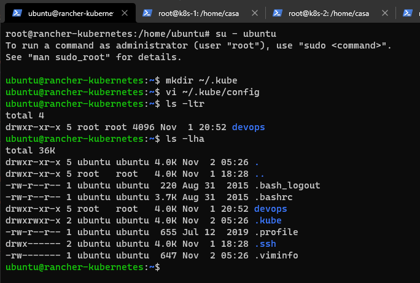

Agora para checar se está tudo funcionando vou executar o comando abaixo que vai se conectar ao Cluster e retornar os nós que estão rodando *`nodes`*

```sh
kubectl get nodes
```

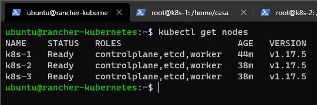

E para pegar todos os pods que estão rodando no namespace kube-system
```sh
kubectl get pods -n kube-system
```
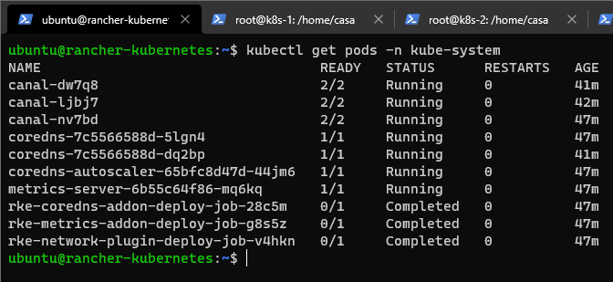

