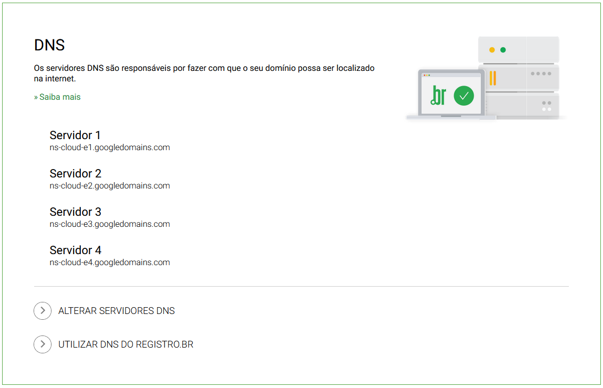

# Prerequisitos

- 4 máquinas virtuais com 2/4 processadores e 6/8 gb de memória ram
- 1 domínio
- Sistema operacional Ubuntu 16.04 LTS
- Domínio a ser utilizado: rcic.com.br

https://github.com/jonathanbaraldi/devops

Teremos 1 máquina que será o Rancher Server e outras 3 máquinas que serão os Kubernetes de produção.

Vou configurar no domínio para apontar para o DNS do Google que será onde eu vou criar as máquinas virtuais e lá no DNS do google eu vou criar entradas do qual o endereço rancher.rci.com.br vai apontar para a máquina quer será o Rancher Server.

Também vou criar um balanceamento com Wildcard ( * ) que conterá os 3 iPs dos outros servidores.

# Domínio

Após dominio criado modificar as entradas DNS para apontar para o DNS do Google ou o provedor escolhido, como por exemplo os DNS da AWS. Para que possamos fazer essa configuração, vamos acessar o GCP e acessar o serviço Cloud DNS para criar uma nova zona que vai receber o domínio.

Expandir a entrada do registro NS para poder pegar os endereços DNS do google que serão preenchidos no site do Registro Br.

Acessar o site do Registro Br e adicionar as entradas DNS.
registro.br

